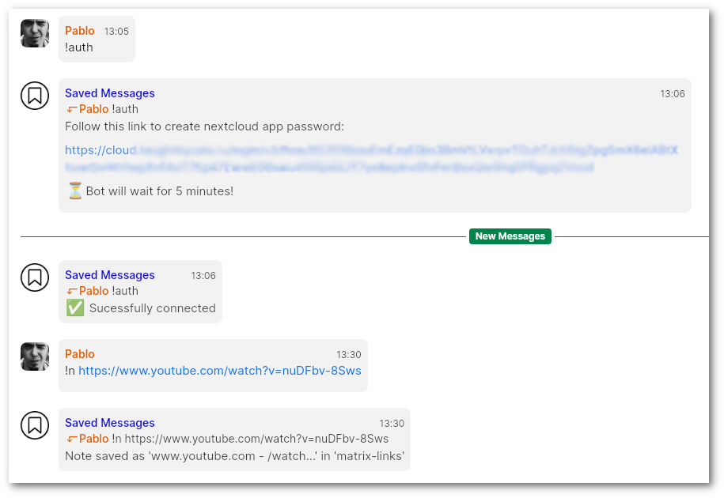

# saved

Save notes to [Nextcloud Notes](https://apps.nextcloud.com/apps/notes) and use this bot as a "Saved Messages" chat, like in Telegram.

## Usage

- `!auth [nextcloud_uri]`: auth to nextcloud instance (uri can be set in config as default for all users)
- `!check`: check nextcloud auth
- `!n note_text`: create note

## Config

- `nextcloud_url`: default nextcloud server URL for all users. If set to 'null' - ask user
- `app_name`: this will be displayed in nextcloud authorized apps
- `title_prefix`: note title prefix
- `categories`: save notes in specific folders, set category to `null` to disable